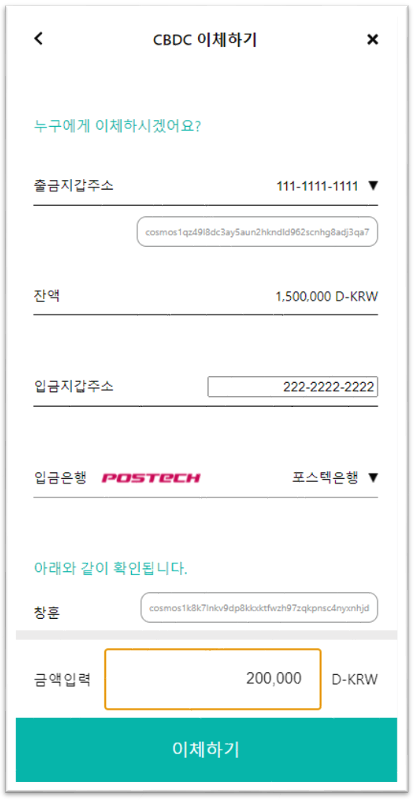
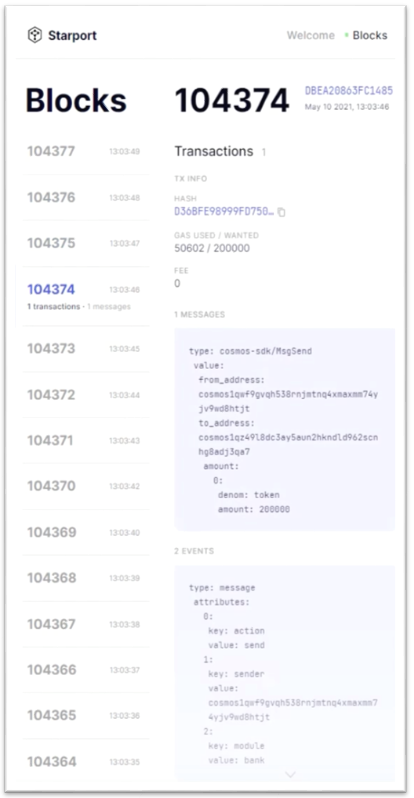

# cosmos-cbdc
CBDC demo project made by cosmos-sdk

## TODO
1. CBDC 발행
   - [x] 시중은행에서 CBDC 발행 요청하는 page 추가
   - [x] 중앙은행에서 CBDC 발행 요청 처리하는 page 추가
   - [x] CBDC Blockchain 연결
   - [x] 시중은행의 중앙은행 당좌예금 page 추가
2. CBDC 환수
   - [x] 시중은행에서 CBDC 환수 요청하는 page 추가
   - [x] 중앙은행에서 CBDC 환수 요청 처리하는 page 추가
3. CBDC 송금 및 대금결제 취소
   - [x] 시중은행 Escrow account 추가
   - [x] User 화면에서 결제 취소 요청하는 기능 추가
   - [x] 상점 화면에서 결제 취소 승인/거절하는 page 추가
   - [x] 3일 지났을 시 재입금하는 스마트 컨트랙트 작성
   - [x] 디자인 요청 반영
   - [x] 영/한 토글 기능 추가
4. CBDC 해외송금
   - [x] Klaytn Testnet(Baobab) 노드 구성, Wallet 발행
   - [x] LFB-SDK를 사용해서 독자적인 Testnet 구성, Wallet 발행
   - [x] Klaytn과 LINE 블록체인과 Cosmos 블록체인 간의 정보 교환 기능 추가
   - [x] Dashboard와 블록체인간의 연동, Dashboard 좀 더 시각화
   - [x] 해외송금 UI 디자인 구현
   - [x] Dashboard와 Server의 DB 이용 최적화 - `현재 작업중`
   - [x] 2차 PoC 데모 준비 - `현재 작업중`

## Build Environment
- node: 14.17.5
- npm: 6.14.14
- go: 1.16.5
- python2: 2.7.18
- starport: 0.14.0
- jq : 1.6

# 파일 설명

## CBDC_server 

<p>
   Cosmos 블록체인과 CBDC a
</p>

## CBDC_blockserver

<p>
   CBDC 해외송금 Dashboard에서 블록체인의 blockNumber와 트랜잭션 정보를 동기화하기 위한 Backend 서버. 본 시스템은 세 가지 블록체인을 사용하는 시나리오를 가정하였으며 각각 Cosmos, Line Financial Blockchain (LFB), Kakao Klaytn이 해당 됨. 현재 세 블록체인 간의 표준화 된 프로토콜이 존재하지 않아 각각의 트랜잭션 정보를 수집하여 하나의 Dashboard를 통해 보여주도록 구현되었음. 본 소스코드 내에는 cosmos blockchain 클라이언트 코드만 들어있으며, LFB와 Klaytn는 각각 로컬 환경에서 구성하여야 함. 각각 블록체인 구성에 대한 참고자료는 아래와 같음.
   
   - [Cosmos](https://github.com/cosmos/cosmos-sdk)
   - [Klaytn](https://github.com/klaytn/klaytn)
   - [LFB](https://github.com/line/lfb)
</p>

- ㅇㅇ
   -

## CBDC_admin

은행 관리 시나리오 데모 프로그램 

- 시중 은행 페이지
   - Distribution.js 파일
   - 시중 은행 CBDC 배정 및 확인 페이지
   - CBDC 잔액 조회 페이지 
- 중앙 은행 페이지
   - Home.js 
   - 중앙 은행 CBDC 발행 및 배정 기능
   
## CBDC_user

유저 서비스 데모, 현재 크롬창 최적화 사이즈: `516 * 992`(viewport)

## CBDC_receiver

해외송금 수취은행 데모

## CBDC_dashboard

해외송금 Blockchain의 transaction 상황을 보기 위한 대시보드

## dpnmd

CBDC 코스모스 블록체인

# 실행 방법

## shell 1 - 서버 실행

디폴트 포트 설정은 다음과 같다.

Admin port : 3001 

User port : 3000

Receiver port: 3002

Server port : 3030


## shell 2 - 블록체인 실행

```
starport serve
``` 

만약 블록이 생성 되지 않는 다면 다른 shell에서 아래와 같은 명령어 실행 시 블록이 생성됨 (에러 메시지가 Trigger 역할을 하는 듯함..)

dpnm은 cosmos-SDK chain 생성 시 초기 세팅한 이름임. 자유롭게 변경가능함

```
dpnmd start
``` 

# 실행 결과

## 실행 이미지(Kor ver.)




## 데모 영상 

[유튜브](https://www.youtube.com/watch?v=DqvWH7rcHTU)
